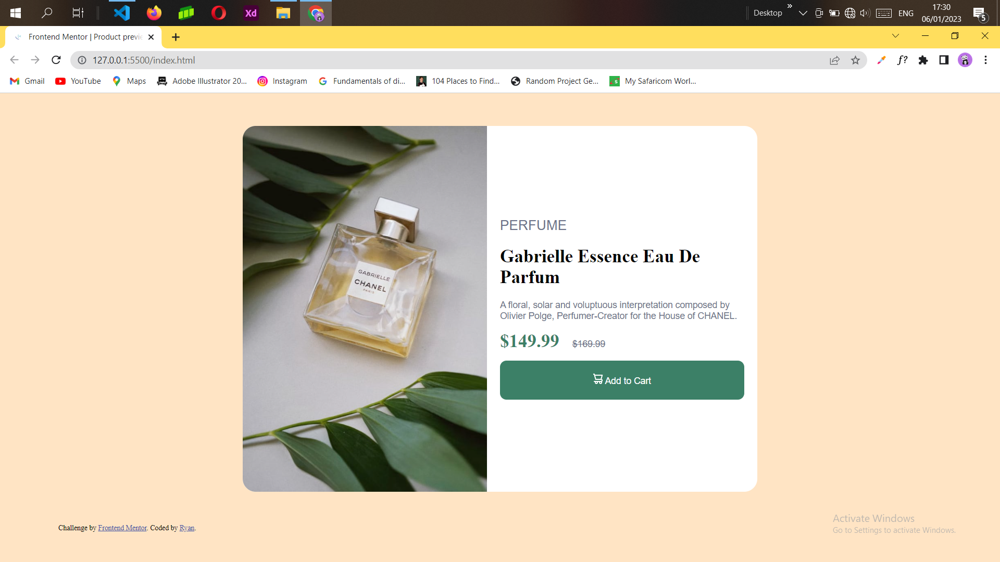
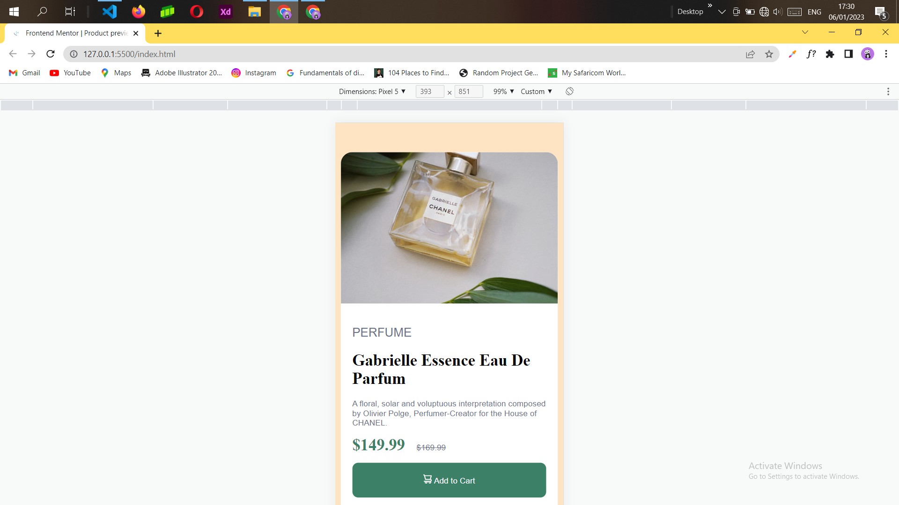

# Frontend Mentor - Product preview card component solution

This is a solution to the [Product preview card component challenge on Frontend Mentor](https://www.frontendmentor.io/challenges/product-preview-card-component-GO7UmttRfa). Frontend Mentor challenges help you improve your coding skills by building realistic projects.

## Table of contents

- [The challenge](#the-challenge)

- [Screenshot](#screenshot)

- [Links](#links)

- [My process](#my-process)

- [Built with](#built-with)

- [What I learned](#what-i-learned)

- [Author](#author)

### The challenge

Users should be able to:

- View the optimal layout depending on their device's screen size
- See hover and focus states for interactive elements

### Screenshot




Here are some screenshots of my solution.

### Links

- Solution URL: [Add solution URL here](https://github.com/ra-y-oo/product-preview-card-component-main/)
- Live Site URL: [Add live site URL here](https://ra-y-oo.github.io/product-preview-card-component-main/)

## My process

I implemented the
mobile first design approach to achive the responsive design of the website.

### Built with

- Semantic HTML5 markup
- CSS custom properties
- Flexbox
- CSS Grid
- Mobile-first workflow
- SCSS

### What I learned

while working on this project i learnt a few thing:

- Responsive web design
- Moble first design
- Use of CSS flexbox

```css
card {
 display: flex;
}
```

## Author

- Website - [Ryan](https://www.your-site.com)
- Frontend Mentor - [@yourusername](https://www.frontendmentor.io/profile/yourusername)
- Twitter - [@_ray00_](https://www.twitter.com/yourusername)
